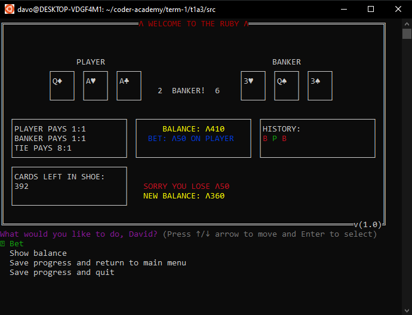
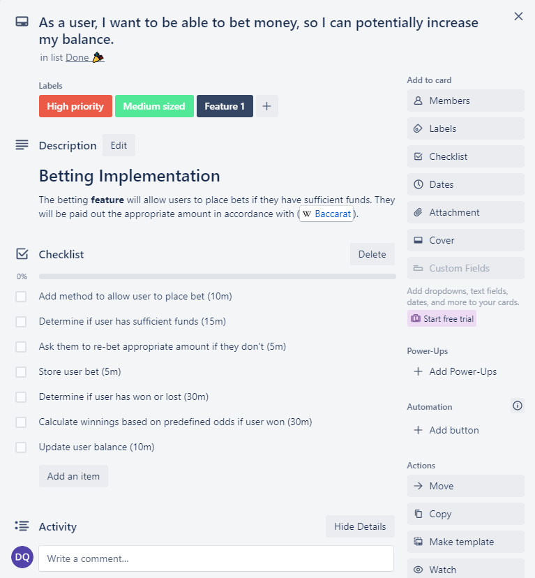
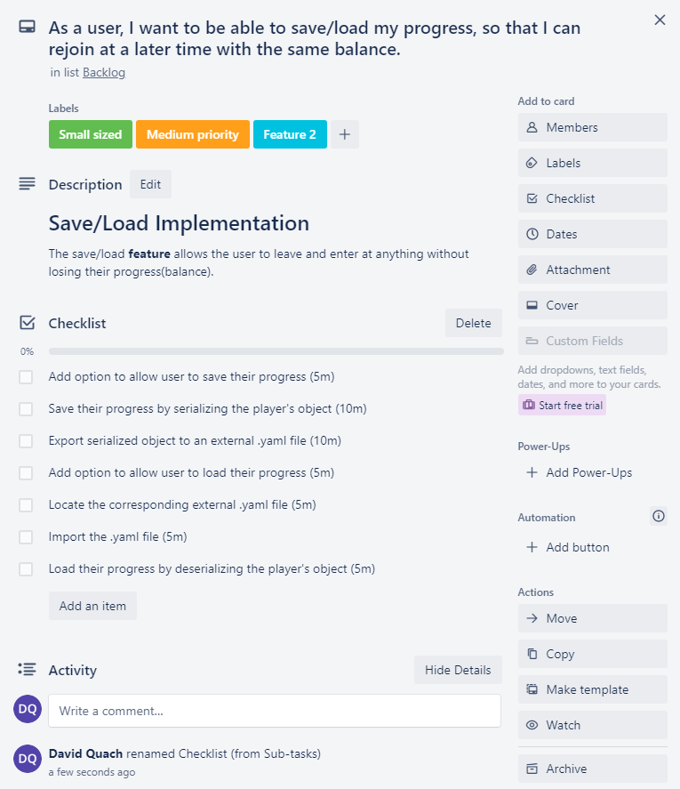
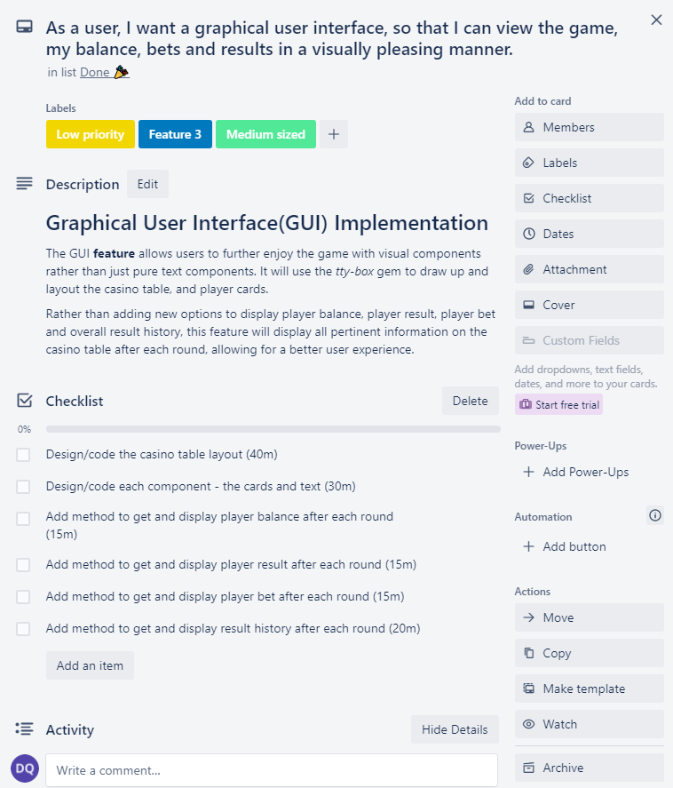

# T1A3 - TERMINAL APPLICATION - [REPO](https://github.com/quachck/T1A3)

## The Ruby
Aptly named, "The Ruby" is casino application run via the terminal, it features the "punto banko" variation of baccarat, a wildly popular card game played at casinos. Other games may be added at a future time.
## How The Application Works
- The application's baccarat game (punto banko variant) is coded 1:1 from [the wiki page](https://en.wikipedia.org/wiki/Baccarat), refer to it for full details about the rules and odds.
- Upon launching the application, the user can either start a new profile or load an existing profile.
- The user will be granted Λ1000 (rubies), the currency of the The Ruby.
- Once the profile is loaded, they're presented with 4 options, `bet`, `display balance`, `save progress and return to main menu` and `save progress and quit`.
- If the user wishes to bet, they'll be prompted to enter what they want to bet on - `player`, `banker` or `tie` and how much they want to bet.
- The user can only enter whole units of rubies i.e. `13` and not `13.1`.
- The round will then play and the relevant information will be displayed on the GUI.
- The result history is colour coded to keep track of the user's results and any occurring streaks.
- The user can play as much as they want and leave and rejoin at any point without losing their progress.
- If the user reaches Λ0, the game will add Λ500 to their account.

 

## What The Application Is Made Of
**Modules**

- Display module to handle all user input and display messages.
- BaccaratRules module to store game logic and odds.
- BaccaratGUI to draw the GUI.

**Game logic**

**The deck of cards:**

The `Deck` and `Card` classes are core parts of baccarat and used to help with the game logic.

**The dealers:**

The `Dealer` class represents the `punto` (player) and the `banko` (banker).

**The player**

The `Player` class represents the user.

**The game**

The `Game` class is the most important class, it deals with running most of the application and the game logic.

## Features
### Betting functionality
Users will be able to test their skills and luck with the betting feature, giving them a chance to increase their fortunes. They will be able to bet any whole unit of rubies and be paid out the appropriate amount based on the established odds.
### Save/load functionality
What good is winning rubies if you're not able to keep them, users will be able to leave and rejoin at any time with the same balance, unfortunately this also means losses are permanent.
### GUI 
It's a card game so the user will expect to see some cards at a minimum, the application features a graphical user interface similar to those seen at sports clubs. It will display critical information such as user balance and bets and game results and statistics, resulting in a visually pleasing experience.

## Implementation Plan - [Trello Board](https://trello.com/b/lLfCgmKq/t1a3)
#### Betting feature (High priority - ≈2hr task)
#### Checklist
- Use tty-prompt's `select` method to allow user to place bet. (10m)
- Use tty-prompt's `ask` method to ask for user bet amount. (10m)
- Create `sufficient_funds?` method to check if user has sufficient funds, raise `InsufficientFundError` if they don't and ask them to place an appropriate bet. (10m)
- Use tty-prompt's `ask` method to ask what the user would like to bet on - player, banker or tie. (10m)
- Store this information as a hash in the player's `bet` attribute. (5m)
- Assess player result. (30m)
- Calculate winnings based on predefined odds if user won. (30m)
- Update user balance. (10m)
  
 

#### Save/Load Feature (Medium priority - ≈1.5hr task)
#### Checklist
- Use tty-prompt's `select` method to allow user to save their progress. (10m)
- Create `save_profile` method to serialize player object. (15m)
- Export serialized to an external `.yaml` file. (10m)
- Use tty-prompt's `select` method to allow user to load their progress. (10m)
- Raise `NoFileError` if user tries to load a profile that doesn't exist and give them the option of either trying again to return to main menu. (30m)
- Locate the corresponding `.yaml` files if it exists. (5m)
- Load their progress by deserializing the player's object (10m)

 

#### GUI Feature (Low priority - ≈2.5hr task)
#### Checklist
- Design the casino table layout. (40m)
- Create `BaccaratGUI` module to handle all table drawing. (5m)
- Create drawing methods for each component - cards and text. (25m)
- Create method to display user bet information and result after each round. (30m)
- Create method to display result and result history after each round. (20m)
- Create method to update the table with all the relevant information after each round. (30m)


 

## Testing
Majority of the application's methods have been tested (47 tests) to ensure it functions as expected and is open to any future updates. Refer to the `spec` folder to see the full suite of tests.

**Testing the betting feature**

The `update_player_bet` method asks what user wants to bet on, how much they want to bet and then stores that information in the player's `bet` attribute for later usage.

**Case 1:**

Assuming the user has sufficient funds, the test 'mocks' the user input and tests if the method correctly stores the bet information. 

**Case 2:**

Assuming the user doesn't have sufficient funds, the test expects the method to raise an `InsufficientFundError` . 

```rb
  describe '#update_player_bet' do
    it 'returns correctly stores bet info' do
      game.player = Player.new("David")
      allow(game).to receive(:ask_bet_amount).and_return('1000')
      allow(game).to receive(:ask_what_bet).and_return(:player)
      game.update_player_bet
      expect(player.bet).to eq([{ player: 1000 }])
    end
    it 'raises an error if insufficient funds' do
      game.player = Player.new("David")
      allow(game).to receive(:ask_bet_amount).and_return('1001')
      expect { game.update_player_bet }.to raise_error(InsufficientFundError)
    end
  end
```

**Testing the load feature**

The `load_profile` method takes a player object as an argument and attempts to load it if it exists.

**Case 1:**

Assuming that the profile the user wants to load exists, it tests that the method is able to locate, deserialize and load the profile. 

**Case 2:**

Assuming that the profile the user wants to load does not exist, the test expects the method to raise a `NoFileError`.

```rb
  describe '#load_profile' do
    it 'loads an existing file if it exists' do
      player = Player.new("test")
      allow(Player).to receive(:from_yaml).with(File.open("save_files/#{player.name.downcase}.yaml", 'r'))
    end
    it "raises NoFileError if file doesnt exist" do
      player = Player.new("non_existent_player")
      expect { game.load_profile(player) }.to raise_error(NoFileError)
    end
  end
```

## Style Guide
The application conforms to [The Ruby Style Guide](https://github.com/quachck/DavidQuach_T1A2).

## Help Documentation
### How to install application
- Clone or download the [repository](https://github.com/quachck/DavidQuach_T1A2) to your local machine.
- Open your terminal in the root directory of the repository.
- Enter `./run_main.sh` to install all required dependencies and start the application.
### Dependencies
- [Ruby](https://www.ruby-lang.org/en/documentation/installation/)
- The following ruby gems are required to start the application, they will **automatically** be installed when you run `./run_main.sh`
```rb
gem "tty-prompt", "~> 0.23.1"

gem "tty-box", "~> 0.7.0"

gem "tty-link", "~> 0.1.1"

gem "rainbow", "~> 3.1"
```
- If you wish to view the application test results, run `gem install rspec` to install RSpec and then run `rspec` in the terminal, ensure you're in the root directory of the repository.
### System/hardware requirements
The application can be run on any modern device that has Ruby, a terminal and a shell.
### Command line arguments
The application can be run with 3 command line arguments
- `./run_main.sh -h` will display help on how to run the application.
- `./run_main.sh -i` will display information about the application.
- `./run_main.sh -r` will display rules about the application.


## References
*The Ruby Style Guide.* (n.d.). Retrieved April 3, 2022, from https://rubystyle.guide/ 

*Wikimedia Foundation.* (2022, March 29). Baccarat. Wikipedia. Retrieved April 3, 2022, from https://en.wikipedia.org/wiki/Baccarat 